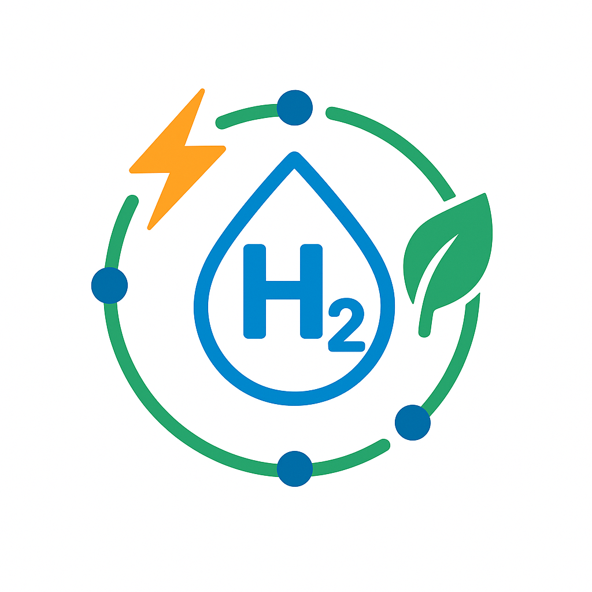

<p align="center">
  
</p>

# Coordinating Multi-Market Participation, Power Purchase Agreements, and Geo-Distributed Site Operations in Hydrogen Enterprises: An Equilibrium-Based ADMM

This repository contains the implementation of the optimization framework developed for the paper “**Hydrogen Enterprises in Hydrogen-Electricity Markets and Guarantee of Origin Schemes: Valuing Coordinated Scheduling, Risk Management & Power Purchase Agreement Procurement**”. It has been developed as part of the **WinHy** project, funded by the Dutch Research Council (NWO) and Repsol S.A.

## 📝 Description

The work introduces a portfolio-level optimization model for hydrogen enterprises, i.e., multi-site, multi-asset agents actively participating in electricity, hydrogen, and green certificate markets, while also managing both physical and virtual Power Purchase Agreements (PPAs). These enterprises face the dual challenge of optimizing their geographically distributed operations and aligning their strategies with evolving green hydrogen policy requirements. The framework integrates four main dimensions:

### 1. Operational Coordination
- Portfolio-level scheduling of decentralized sites, each comprising electrolyzers, Steam Methane Reforming (SMR) technologies, renewable generation units, and electrical energy storage (EES) systems.  
- Management of flexible downstream processes (DSPs) with hydrogen demand shifting.  

### 2. Multi-Market Participation
- Joint clearing of electricity, hydrogen (bundled/unbundled), and green certificate markets.  
- Explicit modeling of interdependencies between market prices and contractual arrangements.  

### 3. Contractual Engagement
- Incorporation of both physical and virtual PPAs as capacity-based agreements.  
- Analysis of how PPAs influence and are influenced by market-clearing dynamics.  

### 4. Risk and Policy Compliance
- Integration of Conditional Value at Risk (CVaR) to evaluate portfolio-level vs. site-level risk hedging strategies.  
- Implementation of EU green hydrogen standards (RED III), ensuring temporal alignment between renewable electricity consumption and hydrogen production through Guarantee of Origin (GO) certificates.  
##
The problem is formulated as a Generalized Nash Equilibrium (GNE) to capture the strategic interactions among multiple self-interested agents, each optimizing its own objectives while being interconnected through shared markets and contracts. This formulation is particularly suited to modeling hydrogen enterprises and other agents (renewables, thermal units) that must balance cost efficiency, contractual obligations, and policy compliance in multi-market environments.
##
To solve this complex decentralized problem, the framework employs an adaptive Alternating Direction Method of Multipliers (ADMM). Unlike standard ADMM, which uses fixed penalty parameters and may converge slowly, the adaptive approach dynamically updates penalty factors during iterations. This adaptive tuning accelerates convergence, reduces computation time, and ensures stable outcomes even under uncertainty. Importantly, the ADMM-based coordination mechanism enables privacy-preserving interactions, since each agent solves its own local optimization problem and only exchanges aggregated information with market settlers rather than full internal data.
##
### Agents Considered in the Framework

**1. Type A Hydrogen Enterprises**  
Operate multiple decentralized sites with electrolyzers, SMR units, renewable generation, energy storage, and flexible DSPs. They participate in electricity, bundled and unbundled hydrogen, and green certificate markets, as well as in physical and virtual PPAs. They employ the CVaR method to manage PPA-related uncertainties.  

**2. Type B Hydrogen Enterprises**  
Operate a single electrolyzer with inflexible DSP. They participate in electricity, hydrogen, and green certificate markets, and in both physical and virtual PPAs, but do not apply risk management strategies.  

**3. Type C Hydrogen Enterprises**  
Do not own hydrogen production units and act solely as consumers. They procure hydrogen from bundled and unbundled hydrogen markets and comply with clean sourcing requirements through the green certificate market.  

**4. Type A Renewable Units**  
These units sell electricity through physical PPAs and issue GOs for the buyer.  

**5. Type B Renewable Units**  
These units sell electricity through physical PPAs and issue GOs for the buyer.  

**6. Type C Renewable Units**  
Sell electricity in the electricity market and trade GOs in the green certificate market.  

**7. Type D Renewable Units**  
Flexibly allocate capacity between physical PPAs and the electricity market, while issuing and trading GOs accordingly.  

**8. Thermal Units**  
Provide dispatchable electricity generation and participate exclusively in the electricity market.  

---

## ✨ Key Features
- Multi-market integration: Co-optimizes participation in electricity, hydrogen (bundled and unbundled), and green certificate markets.  
- Portfolio-level coordination: Unlocks flexibility by centrally scheduling distributed assets across multiple sites, beyond individual asset operation.  
- Contractual heterogeneity: Supports both physical and virtual Power Purchase Agreements (PPAs) with take-as-produced structures.  
- Policy compliance: Incorporates company-level green hydrogen targets, certification rules, and clean energy temporal matching constraints.  
- Scalability: Applicable to hydrogen-centric companies of different sizes with multiple operational scenarios.  

---

## ⚙️ Model Highlights
- Implemented as a day-ahead operational planning model.  
- Objective function maximizes total company profit, considering hydrogen sales revenues, certificate transactions, electricity market exchanges, and PPA settlements.  
- Captures asset-level technical constraints (electrolyzers, energy storage, renewable generation).  
- Enables comparative analysis of different compliance strategies (per-site vs. portfolio-level enforcement).  

---

## 🧪 Case Study
The framework is demonstrated on a representative hydrogen-centric company (**H2FLEX**) operating five sites across Spain. Three operational setups are compared:  
1. Decentralized site-level operation  
2. Centralized PPA dispatch  
3. Full portfolio-level coordination with centralized policy enforcement  

---

## 📊 Key Results
- Centralized coordination enables up to a **2.42× increase in hydrogen production**.  
- Achieves a **9.4% reduction in daily operational costs**.  
- Portfolio-level enforcement improves flexibility, allowing **46.6% higher hydrogen production** while maintaining green hydrogen certification compliance.  

---

## 📂 Repo Structure

```
├─ H2FlexCo.ipynb                # Main Jupyter Notebook with the optimization model
├─ H2FlexCo.py                   # Python version of the Main Jupyter Notebook
├─ SimData.xlsx                  # Excel file containing the input simulation data
└─ requirements.txt              # List of required Python packages
├─ Cases/                    
│  ├─ Decentralized.ipynb        # Decentralized site-level operation
│  ├─ Centralized_PPA.ipynb      # Centralized PPA dispatch
│  └─ Portfolio_Level.ipynb      # Full portfolio-level coordination with centralized policy enforcement
```

---

## 🚀 Requirements

Install the necessary Python libraries using:

```bash
pip install -r requirements.txt
```

---

## 📈 How to Run

1. Open `H2FlexCo.ipynb` in Jupyter Notebook or JupyterLab.
2. Ensure `SimData.xlsx` is in the same directory as the notebook.
3. Run all cells in the notebook to execute the model and generate results.

---

## 📦 Dependencies

The code uses the following libraries:
- `pyomo`
- `pandas`
- `numpy`
- `matplotlib`
- `seaborn`
- `tabulate`
- `ipython`
- `jupyter`

You also need a solver like GUROBI for Pyomo.

<!-- ## 📚 Citations
If you use this repository in your work, please cite: -->

---

## 📝 License

MIT License.
